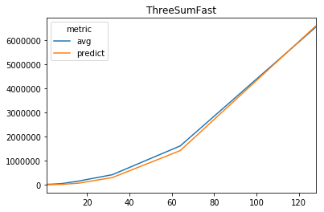

Threesum Comparison

The threesum problem is where you count the combinations of a list of 
	integers that sum to 0.

	
This is a comparison of the following algorithms for the threesum problem:
* Bruteforce	n^3 iterate through all combinations of three
* Fast			n^2log(n) iterates through all combinations of two and 
					searches for the complement
* Fastest		n^2 uses a hashmap to search through combinations

The following functions are passed a list and return the threesum:
* ThreeSumBruteForce
* ThreeSumFast
* ThreeSumFastest

Drivercode in threesum.py
* Edit the following variables to change funcationality:
	* EXPERIMENTS	changes how many times function is run per loop
	* MAX_BASE		list_length is doubled each loop up to 2^MAX_BASE
* Times each function for various list lengths, outputs progress bar
* Creates a regression for each function plot points
* Plots one linear-linear plot for each function's actual values and 
	predict values (example below)
* Plots one log-linear plot for each function's actual values and 
	predict values

VerifyThreeSum function
* This function has a few test cases to verify functionality.
* It is not called in the driver code.

Requires the following python packages:
* python standard library
* matplotlib
* scipy
* tqdm
* pandas

Project Status: Complete - no future work planned.